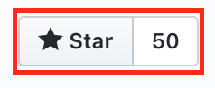

<h3 align="center">Ruby on Rails Interview Questions! :tada:</h3>
<p align="center">
    
  <a href="https://github.com/ellerbrock/open-source-badges/">
      
  </a>
  <a href="https://saythanks.io/to/rishiip" target="_blank">
      
  </a>
</p>

------------

1. **What are the advantages of using Ruby on Rails in Web Development?**
    - A good article from [Sentia](http://www.sentia.com.au/blog/8-benefits-of-using-ruby-on-rails-for-web-development)
    - A good article from [Toptal](http://www.toptal.com/ruby-on-rails/after-two-decades-of-programming-i-use-rails)

2. **What are the disadvantages of using Ruby on Rails in Web Development?**
    - A nice answer from [StackExchange](http://programmers.stackexchange.com/a/85576/142368)

3. **What do you mean by `Agile Development`?**
    - A good page on [WikiPedia](https://en.wikipedia.org/wiki/Agile_software_development)
    - A good explaination on [TutotialsPoint](http://www.tutorialspoint.com/sdlc/sdlc_agile_model.htm)

4. **Explain MVC in terms of Rails.**
    - A good explaination on [TutotialsPoint](http://www.tutorialspoint.com/ruby-on-rails/rails-framework.htm)

5. **What are different components of Ruby on Rails?**
    * [Slidershare] (http://www.slideshare.net/ifuturz/get-aware-of-ruby-on-rails-components)

6. **Give list of frameworks which is similar to Rails.**
7. **What makes Ruby different from other programming languages?**
8. **What do you mean by Meta Programming?**
9. **Explain how everything is an object in Ruby.**
10. **How could you explain the Ruby OOP model?**
11. **Give difference between last 3 versions of Rails.**
12. **What's the major improvements in Rails 5.0?**
    * A good article from [Site Point](http://www.sitepoint.com/whats-new-rails-5/)
    * Another good blog post from [Michelada] (http://blog.michelada.io/whats-new-in-rails-5)

13. **What do you mean by ORM?**

14. **What is the difference between eager and lazy loading in rails?**
    * A good explanation can be found from [spritle.com] (https://www.spritle.com/blogs/2011/03/17/eager-loading-and-lazy-loading-in-rails-activerecord/

15. **What is Self-Referential Association aka Self Join?**
    * A good explanation from [Rails Casts] (http://railscasts.com/episodes/163-self-referential-association)

16. **List down types of associations in Rails.**
17. **What is functionality of `Helpers`?**
18. **Explain eagerloading.**
    * A good article with types of preloading [eagerloading] (http://blog.arkency.com/2013/12/rails4-preloading)

19. **What are your favourite Gems?**
20. **Define block, proc and lambda and give difference between them.**
21. **What is ActiveRecord?**
22. **Explain Active Record Callbacks.**
    * A good explanation from [Ruby on Rails Guides] (http://guides.rubyonrails.org/active_record_callbacks.html)

23. **Explain Filters.**
24. **Define resource, resources, collection and namespace in terms of routes.**
25. **List down servers supported by Rails.**
26. **What things we can define within `Model`?**
27. **What is Asset Pipeline?**
    * [Official documentation](http://guides.rubyonrails.org/asset_pipeline.html)

28. **How parsing has been done from ERB file to HTML?**
29. **What is difference between `String` and `Symbol`?**
    * Necessary information about Strings and Symbols could be found [there](http://www.reactive.io/tips/2009/01/11/the-difference-between-ruby-symbols-and-strings/)

30. **What is difference between `Render` and `Redirect`?**
31. **What is difference between `Gems` and `Plugins`?**
32. **What is difference between `Gemfile` and `Gemfile.lock`?**
33. **What is difference between `save` and `save!`**
34. **What is difference between `find` and `find_by_xxx` method?**
35. **What is difference between `includes` and `extends`?**
36. **What is difference between `form_for` and `form_tag`?**
37. **What is difference between `TDD` and  `BDD`?**
38. **What is difference between `Application Server` and `Web Server`?**
39. **What is difference between `==`, `===`, `eql?` and `equal?`?**
40. **What is single table inheritance(STI) in Rails?**
    * Necessary information could be found [here](https://api.rubyonrails.org/classes/ActiveRecord/Inheritance.html)
41. **What is polymorphic associations in Rails? How it is differ from single table inheritance?**
    * Necessary information could be found     -     [here](https://medium.freecodecamp.org/single-table-inheritance-vs-polymorphic-associations-in-rails-af3a07a204f2)
42. **What will be printed after running the code** [here](https://gist.github.com/engr-hasanuzzaman/9556121c9fd954eb077ac39ed19fe8d1)?
    * Awswer of the above question is [here](https://gist.github.com/engr-hasanuzzaman/8080ceb3394e83de6412f44710149387)
43. **Lets say you have a controller method that you want to access from view. How will you do that?**

------------
## Contribution Guidelines

* The question must be unique
* Question must be related with Ruby/Rails
* A pull request must contain only single question

------------

If you like this repository, don't forget to star it using star button available at top right like following -



------------

<a rel="license" href="http://creativecommons.org/licenses/by/3.0/deed.en_US"></a><br/><span xmlns:dct="http://purl.org/dc/terms/" href="http://purl.org/dc/dcmitype/Text" property="dct:title" rel="dct:type">Ruby on Rails Interview Questions</span> by <a xmlns:cc="http://creativecommons.org/ns#" href="https://github.com/rishiip/rails-interview-questions" property="cc:attributionName" rel="cc:attributionURL">Rishi Pithadiya</a> is licensed under a <a rel="license" href="http://creativecommons.org/licenses/by/3.0/deed.en_US">Creative Commons Attribution 3.0 Unported License</a>.

```
- goto localhost:3001 on a webbrowser
- Input the webpage URL and click on submit